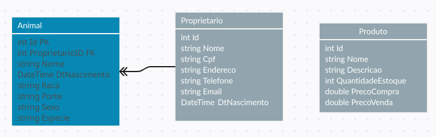

 <h1>Pet Shop Manager - Aplicação Web em .NET</h1>
 
Pet Shop Manager é uma aplicação web simples desenvolvida em .NET que tem como objetivo auxiliar no gerenciamento de um Pet Shop. A aplicação permite o cadastro de usuários, animais e produtos, proporcionando um controle eficiente e organizado das atividades do estabelecimento.

 <h2>Tecnologias Utilizadas</h2>
 <ul>
    <li>ASP.NET Core: Framework de desenvolvimento web em .NET.</li>
    <li>C#: Linguagem de programação usada no desenvolvimento da aplicação.</li>
    <li>Entity Framework Core: ORM (Object-Relational Mapping) utilizado para facilitar o acesso e manipulação do banco de dados.</li>
    <li>HTML, CSS e JavaScript: Tecnologias utilizadas na construção da interface do usuário.</li>
    <li>Banco de Dados: A aplicação utiliza um banco de dados SQLite</li>
 </ul>
 <h2>Funcionalidades</h2>
 
A aplicação Pet Shop Manager oferece as seguintes funcionalidades:

 <ul>
    <li>Cadastro de Usuários: Permite registrar informações dos clientes e funcionários do Pet Shop.</li>
    <li>Cadastro de Animais: Permite cadastrar e visualizar informações sobre os animais atendidos no estabelecimento.</li>
    <li>Cadastro de Produtos: Possibilita gerenciar o estoque de produtos do Pet Shop.</li>
    <li>Relatórios: Oferece recursos para gerar relatórios de vendas, atendimentos e outras informações relevantes.</li>
 </ul>
 <h2>Diagramas</h2>
 <h3>Diagrama de Entidade-Relacionamento (ER)</h3>
 

 
O diagrama de entidade-relacionamento representa a estrutura do banco de dados da aplicação, mostrando as tabelas e seus relacionamentos.

 <h2>Como Executar o Projeto</h2>
 <ol>
    <li>Clone este repositório para o seu ambiente local.</li>
    <li>Certifique-se de ter o .NET Core SDK instalado em sua máquina.</li>
    <li>Execute o comando <code>dotnet restore</code> para restaurar as dependências do projeto.</li>
    <li>Configure a string de conexão com o banco de dados no arquivo <code>appsettings.json</code>.</li>
    <li>Execute o comando <code>dotnet ef database update</code> para aplicar as migrações e criar o banco de dados.</li>
    <li>Finalmente, execute a aplicação com o comando <code>dotnet run</code> e acesse-a em seu navegador.</li>
 </ol>
